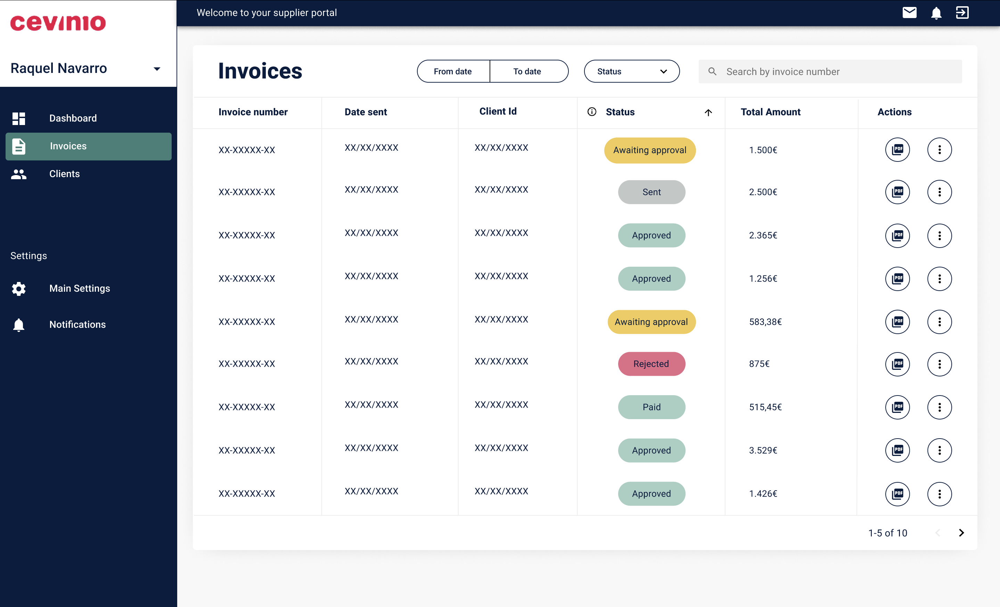

## My role

As the Product Owner at Cevinio, a B2B company, I worked with our multidisciplinary team to design and launch a new supplier portal.**My responsibilities included conducting user research, managing stakeholders, and defining the functional requirements for the portal.** I collaborated closely with developers, UX designers, and external partners to create a solution that bridged the gap between companies, suppliers, and accounts payable (AP) agents.

## Product

Cevinio **streamlines invoice processing by providing a unified platform for companies and suppliers.**

For companies, Cevinio **automates high-volume invoice workflows—capturing,** validating, and routing invoices for approval—ensuring compliance and accuracy while saving time.

For suppliers, the **dedicated portal accelerates payment cycles, provides real-time visibility into invoice statuses,** and facilitates direct communication with AP agents.

This seamless invoicing experience eliminates delays, fosters transparency, and creates value for all stakeholders.

## Problem definition

Before the supplier portal, **suppliers had no clear visibility into the status of their invoices** or any existing issues, such as missing information or unclear due dates. Communication between suppliers and AP agents was inefficient, often hindered by time zone differences and the fact that AP agents were frequently external contractors.

Suppliers lacked:

- Easy access to invoice statuses.
- A means to identify and resolve issues quickly.
- A direct communication channel with AP agents.

Additionally, **Cevinio needed a way to demonstrate its value to supplier companies through the portal,** potentially converting suppliers into future clients.

## Solution

To address these challenges, **I designed a supplier portal that streamlined invoice management and improved communication.**
First, I conducted **user interviews to understand suppliers needs** and identified the most critical invoice statuses to display. I then **mapped these statuses to Cevinio's internal systems, ensuring seamless integration.**

The portal included the following features:

- **Real-time status tracking:** Suppliers could view their invoices' current stage in the workflow.
- **Advanced search and filtering:** Suppliers could search invoices by date, status, and other key criteria.
- **Download functionality:** Suppliers could easily download original invoice documents for review.
- **Direct communication:** A chat feature allowed suppliers to contact the AP agent responsible for their invoices, enabling quicker resolution of issues.

The Figma prototype of the portal can be reviewed here: [Supplier Portal Prototype.](https://www.figma.com/design/sUfeeF5FC8Ng2TAoee87LI/Supplier-Portal?node-id=5687-116&p=f&t=8InGMXfTzpGqMIhK-0)

## Key takeaways

- User-Centered Design: Conducting **user interviews early in the process ensured the portal addressed the actual needs** of suppliers and aligned with business goals.
- Cross-Functional Collaboration: Effective **communication and coordination across teams,** including UX, engineering, and external contractors, were essential to the portal's success.
- Streamlining Complex Workflows: **Mapping supplier-facing statuses to internal systems reduced friction in the invoicing process** and improved transparency for all stakeholders.
- Leveraging Tools for Communication: By integrating a **chat feature, the portal bridged the communication gap between suppliers and AP agents,** significantly reducing response times.
- Driving Business Growth: The supplier portal **not only solved immediate pain points but also became a valuable touchpoint** for showcasing Cevinio's offerings to potential clients.
