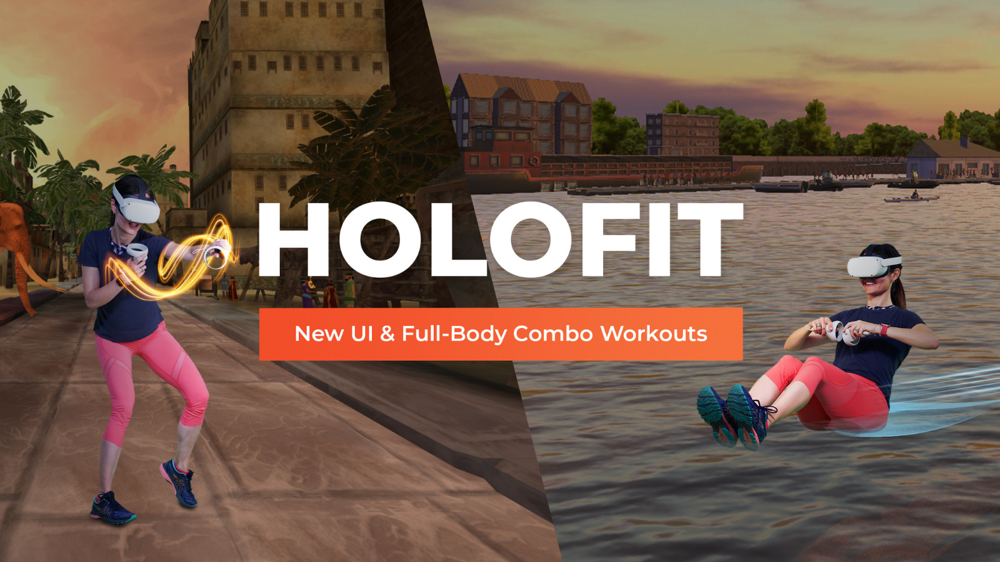

## My role

As the sole Product Manager at Holodia, I owned product strategy and roadmap definition, working At Holodia, I was the first and sole Product Manager. I owned product strategy, roadmap definition, and monetization, working closely with the founders, CEO, COO, and engineering team.

Because the company had never had a PM before, part of my role was introducing more structured, data-informed decision-making. I led user research, defined priorities, and drove initiatives across growth, retention, and revenue.

My main responsibility was identifying and unlocking the company’s largest growth opportunities.

## Product Context

Holofit is a subscription-based VR fitness app for users training with rowing machines, bikes, ellipticals, or in freestyle mode without equipment.

The product combines immersive virtual environments with gamified workouts to increase motivation and long-term engagement.

## Problem & Opportunity

When I analyzed our funnel using Amplitude, store reviews, and user interviews, I identified a major structural imbalance.

Users with fitness machines converted five times better than users without machines.However, around 80% of new users did not own equipment.

At the same time:

- Users struggled to understand onboarding and progression.
- Many abandoned the app after a very short first session.
- Store reviews mentioned frustration with paying before experiencing real value.

This meant that Holofit performed well in a niche segment but underperformed in its largest addressable market. We were leaving significant growth and revenue on the table.

## User Insights

Quantitative analysis showed high early churn and low activation among freestyle users.

Qualitative interviews revealed that:

- Users didn’t understand what success looked like in the app.
- They felt blocked too early by the paywall.
- They didn’t know how to get value without equipment.

This showed that the core issue was not product quality, but unclear onboarding and poor value communication.

## Strategy & Prioritization

Given limited engineering capacity, I had to balance core product improvements with a major external opportunity.

At the same time we identified onboarding and monetization issues, we were offered a sponsorship to build a new AR mini-game. An important VR company would finance its development and promote it prominently in their App Store, giving us significant distribution and brand exposure.

This was a high-impact growth opportunity, but it required substantial engineering effort and had a fixed delivery timeline.

As a result, we couldn’t fully redesign onboarding and build the AR experience in parallel.
I therefore reframed the roadmap around two goals:

- Deliver a minimum valuable version of the new onboarding and paywall that could improve conversion quickly
- Allocate enough capacity to ship the sponsored AR game on time and maximize the partnership benefits

We prioritized high-leverage changes, such as paywall positioning, removing restrictive limits, and simplifying early flows, while postponing deeper onboarding iterations.

This allowed us to improve monetization and activation in the short term, while also leveraging Meta’s promotion to accelerate acquisition.

The main trade-off was speed versus depth: we accepted a more incremental onboarding rollout in exchange for a major distribution boost.

## Solution

### 1. Repositioning the Free Experience

We redesigned the paywall to support acquisition and education, not only monetization.
We:

- Tested multiple demo copies
- Rebranded “Demo” as “Limited Free Plan”
- Removed the 5-minute usage cap
- Introduced unlimited access to two environments
- Added a contextual paywall after meaningful engagement

To improve perceived value, we added:

- A gameplay showcase video
- A carousel with real user reviews
- This reframed the free experience from a restriction into a true entry point.

<video autoplay loop muted playsinline width="100%">
  <source src="/holodia-lobby.mp4" type="video/mp4">
  Your browser does not support the video tag.
</video>

### 2. Segment-Based Onboarding

We redesigned onboarding around two primary segments:

- Machine users
- Freestyle users

Each journey:

- Highlighted relevant environments
- Explained progression and trophies
- Clarified how to get value without equipment
- Reduced early cognitive load

This ensured users immediately understood how Holofit fit into their lifestyle.

## Delivery & Validation

Because Holofit is a VR app distributed through platform stores, we couldn’t easily run traditional A/B tests.

Instead, I designed a quasi-experimental approach using historical benchmarks and cohort analysis.
We:

- Compared performance against the previous three months
- Analyzed new-user cohorts before and after launch
- Controlled for seasonality and acquisition sources

This allowed us to validate impact despite technical constraints.

We rolled out changes iteratively using feature flags and monitored behavior closely before scaling.

## Impact & Metrics

We defined success around activation, conversion, and early retention.

Compared to the previous three months:

- Freestyle conversion increased by 36%
- Machine user conversion increased by 11%
- Average time spent in the first 28 days increased by 117%
- Review scores improved from around 3.5 to 3.8

The increase in early engagement was particularly important because it strongly correlated with long-term retention and subscription likelihood.

Most importantly, the conversion gap between machine and non-machine users narrowed significantly, improving revenue efficiency and scalability.

## Risks & Ambiguity

At the beginning, it was unclear whether low conversion was driven by pricing, product quality, or misunderstanding.

We reduced uncertainty through:

- Funnel analysis
- User interviews
- Small experiments before major changes

The biggest risk was harming short-term revenue. We mitigated it by monitoring churn weekly and being ready to roll back changes if needed.
